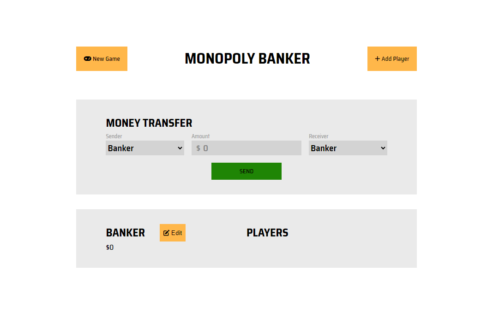

# Monopoly Banker System

Welcome to the Monopoly Banker System! This project is a web-based implementation of a Monopoly banker system, where users can manage players, make transfers, and interact with a dynamic UI.

## Table of Contents

- [Project Overview](#project-overview)
- [Features](#features)
- [Technologies Used](#technologies-used)
- [How to Use](#how-to-use)
- [Screenshots and Screen Recording](#screenshots-and-screen-recording)
- [Contributing](#contributing)
- [License](#license)

## Project Overview

The Monopoly Banker Game is a simple application that simulates the banking aspect of Monopoly. Players can be added, and money can be transferred between them. The application also includes a dynamic UI that updates in real-time as actions are performed.

## Features

- **New Game:** Start a new game with a default banker.
- **Add Player:** Add new players to the game with customizable names.
- **Money Transfer:** Transfer money between players, including the banker.
- **Banker Balance Edit:** Edit the balance of the banker directly from the UI.
- **Responsive Design:** Adjusts layout for different screen sizes, including mobile.

## Technologies Used

### HTML

- **Semantic Elements:** Used to structure the page with `<section>`, `<nav>`, and `<div>`.
- **Forms and Inputs:** Implemented for user interactions with `<select>`, `<input>`, and `<button>` elements.

### CSS

- **Flexbox:** Used to create responsive layouts, including navigation and sections.
- **Media Queries:** Adjusts layout for screens smaller than 820 pixels to ensure a user-friendly experience on mobile devices.
- **Styling:** Applied to enhance the visual appearance of buttons, inputs, and tables.

### JavaScript

- **Object-Oriented Programming (OOP):** Utilizes classes to manage players and game logic. Includes `Player` and `MonopolyGame` classes.
- **Event Handling:** Listens for user actions (e.g., button clicks) to update the UI and game state.
- **Dynamic UI Updates:** Modifies the DOM to reflect changes in player balances, available players, and other game elements.

## How to Use

1. **Clone the Repository:**
   ```bash
   git clone https://github.com/yourusername/monopoly-banker-game.git

2. **Navigate to the Project Directory:**
   ```bash
   cd monopoly-banker-game

3. **Open index.html in a Browser:** Simply open the index.html file in your preferred web browser to start using the application.

4. **Interact with the Game:**
    - Click on "New Game" to start a new session.
    - Add players using the "Add Player" button.
    - Transfer money between players using the "SEND" button in the Money Transfer section.
    - Edit the banker's balance using the "Edit" button.

## Screenshots and Screen Recording

- **Screenshots:**
  
  

- **Screen Recording:**
  Watch the demo video [here](images/screenrecording.mp4).


## Contributing
Contributions are welcome! If you'd like to improve this project, please follow these steps:
1. Fork the repository.
2. Create a new branch (git checkout -b feature-branch).
3. Make your changes.
4. Commit your changes (git commit -am 'Add new feature').
5. Push to the branch (git push origin feature-branch).
6. Create a new Pull Request.

